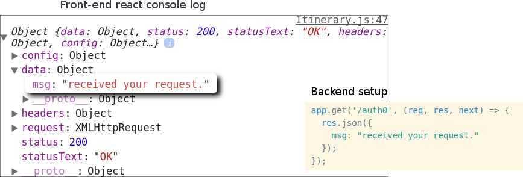

1. [React](#react-router-navigation)
2. [Server Calls](#server-calls)

# React
## React router navigation


Using `BrowserRouter` from `react-router-dom`, its possible to navigate  
back and forth between component routes by calling methods   
like `goForward()` & `goBack()`  

To call these methods, within the routed component(*s*),  
##### 1. Import
```js
import {withRouter} from 'react-router-dom';
```
##### 2. Export
Then in the export portion call the `withRouter()` method as such:  
```js
export default withRouter(Itinerary);
```  
But if the export is used in conjunction with `connect` from `react-redux` (**redux store**)
Use it this way:  
```js
Itinerary = connect(mapStateToProps, mapDispatchToProps)(Itinerary);
export default withRouter(Itinerary);
```
##### 3. Use
```js
this.props.history.goBack();
```
# Server calls

## Setting up proxy
**In package.json**,  
```json
// doesn't work..
"proxy":"http://localhost/3001/",  
"proxy":"http://localhost/3001",
```  

<strong>works:</strong>
```js
"proxy":{
  "/users": {
    "target": "http://localhost:3001",  
    "ws":true
  },
  // ↓ without the "/", it works as well.
  "trips": {
    "target": "http://localhost:3001",
    "ws":true
  }
},
```
<em>↑ works</em> bcos: ( exclude the last **/** from *url* )  

**In axios call**,  
```js
componentWillMount(){  
  console.log('prior axios call');
  let self = this;
  // error using func(){} instead of (param)=>{}
  // fat pipe below binds the state.  
  axios.get('/users/1').then(res => {        
    self.setState({
      user: res.data
    });        
  }).catch(function(err){
    console.log('Error in server call: ',err);
    if (err.response) {
      console.log('server responded with err: ', err.response);
    }
  })
}
```
**Actually to axios call then set state, just do:**,  
```js
constructor(props){
  super(props);
  this.state = {
    options: []
  };
}

componentDidMount(){  
  axios.get('categories').then(res=>{
    if (res.data) {
      this.setState({
        options:res.data
      });
    }
  });
}
```
## Proxy-ing to a 3rd server (express):
**frontend setup**:
```
"auth0": {
  "target": "http://localhost:3005",
  "ws":true
}
```
 **backend setup (express)**:
```js
// change listening port (3000 --> 3005)
app.set('port', process.env.PORT || 3005);

// set up route
app.get('/auth0', (req, res, next) => {
    res.json({
      msg: "received your request."
    });
  });
```
**frontend axios call**:
```js
componentWillMount(){      
  console.log('prior axios call to express');
  let self = this;
  axios.get('/auth0').then(res => {
    console.log(res);
  }).catch(function(err){
    console.log('Error in server call: ',err);
    if (err.response) {
      console.log('server responded with err: ', err.response);
    }
  })
}
```

### Result


### Important! Last item cannot have comma
```
"proxy": {
  "/users": {
    "target": "http://localhost:3001",
    "ws": true
  },
  "trips": {
    "target": "http://localhost:3001",
    "ws": true
  },
  "auth0": {
    "target": "http://localhost:3005",
    "ws": true
  },
  "categories": {
    "target": "http://localhost:3001",
    "ws": true
  }             <cannot have comma!
},
```
# <span style="color:red">Always <strong>yarn start</strong> after editing package.json</style>
(to pick up changes. not auto)
